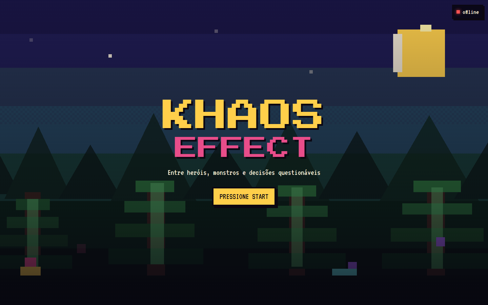

# Khaos Effect

VTT multiplayer real para um RPG de mesa comico/acido em portugues do Brasil.

Esta build e um HTML single-file com Supabase, lobby real, criacao de personagem e mesa inicial.



## Rodar

Abra `index.html` no navegador.

Como o app usa Supabase via CDN, a parte multiplayer precisa de internet.

## Estrutura

- `index.html` - build final pronta para abrir.
- `src/khaos_effect_template.html` - template editavel.
- `data/khaos_effect_data.js` - dados canonicos do jogo.
- `scripts/build_khaos_effect.js` - gera `index.html` a partir do template + dados.
- `scripts/validate_khaos_effect.js` - valida IDs, dados canonicos e sintaxe JS.
- `docs/` - estado do projeto e handoff para colaboracao.

## Build e validacao

```bash
npm run build
npm run validate
```

## Dados canonicos

As contagens esperadas sao:

- 20 racas
- 13 classes
- 39 subclasses
- 292 cartas narrativas em 18 categorias

Nao crie, renomeie ou remova racas/classes/subclasses/cartas sem instrucao explicita do Lucas.

## Stack

- HTML/CSS/JS single-file
- Supabase JS via UMD CDN
- Supabase Realtime
- Pixel art em SVG inline

## Status

Veja `docs/build_status.md`.
